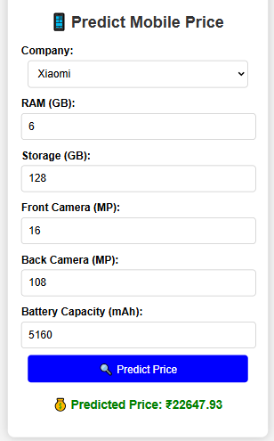

# 📱 Mobile Price Prediction MVP  

This project is a **Mobile Price Prediction** system that uses **Machine Learning** to predict mobile phone prices based on various features like **RAM, ROM, Camera, Battery, and Company brand**.  

## 🚀 Features  
✅ **Accurate Price Prediction** (99% Accuracy)  
✅ **Domain Knowledge Integration** (Company-based pricing trends, RAM-ROM compatibility, etc.)  
✅ **Interactive Frontend** with animations & loading effects  
✅ **User-Friendly Interface**  
✅ **Backend API (Flask)** for ML Predictions  

---

## 🛠️ Tech Stack  
- **Frontend:** HTML, CSS, JavaScript  
- **Backend:** Flask (Python)  
- **Machine Learning Model:** RandomForestRegressor  
- **Data Preprocessing:** Pandas, Scikit-learn  
- **Styling & Animations:** CSS & JavaScript  

---

## 📂 Project Structure  

```
📁 mobile-price-prediction-mvp  
│── 📂 static/            # Static files (CSS, JS)  
│── 📂 templates/         # HTML templates  
│── 📂 models/            # Trained ML Model  
│── 📂 data/              # Mobile Dataset  
│── app.py               # Flask Backend API  
│── main.py              # Data Preprocessing & Model Training  
│── requirements.txt     # Required Libraries  
│── demo.png             # Demo Image  
│── README.md            # Project Documentation  
```  

---

## 🔧 Installation & Setup  

1️⃣ **Clone the repository:**  
```bash
git clone https://github.com/Sandeepmopidevi/Mobile-Price-Prediction.git
cd Mobile-Price-Prediction
```

2️⃣ **Install dependencies:**  
```bash
pip install -r requirements.txt
```

3️⃣ **Train the Model (if needed):**  
```bash
python train_model.py
```

4️⃣ **Run Flask API:**  
```bash
python app.py
```

5️⃣ **Open in Browser:**  
Go to **`http://127.0.0.1:5000`** to access the web interface.  

---

## 📊 Dataset Features  

| Feature         | Description |
|----------------|-------------|
| **Company**     | Brand name (Samsung, Xiaomi, etc.) |
| **RAM**         | Random Access Memory (GB) |
| **ROM**         | Internal Storage (GB) |
| **Front Camera** | Front Camera Megapixels |
| **Back Camera**  | Back Camera Megapixels |
| **Battery**      | Battery Capacity (mAh) |
| **Screen Size**  | Display Size (in inches) |
| **Weight**       | Device Weight (grams) |
| **Price (Target)** | Mobile Price in INR |

---

## 🎯 Prediction Logic  

🔹 **RAM-ROM compatibility:** Ensures valid RAM-ROM combinations.  
🔹 **Company-based pricing trends:** Higher-end brands cost more.  
🔹 **ROM-based price difference:** Approx. ₹2000 per 64GB storage upgrade.  
🔹 **Screen size & weight impact:** Adjusts pricing based on usability.  

---

## 🎥 Demo  

  

---

## 💡 Future Enhancements  
✔️ Add More Mobile Brands & Features  
✔️ Improve UI with Advanced Animations  
✔️ Deploy on Cloud for Public Access  

---

## 🤝 Contributing  
Feel free to **fork this repo** and submit pull requests for improvements!  

---

## 📜 License  
This project is **open-source** under the **MIT License**.  